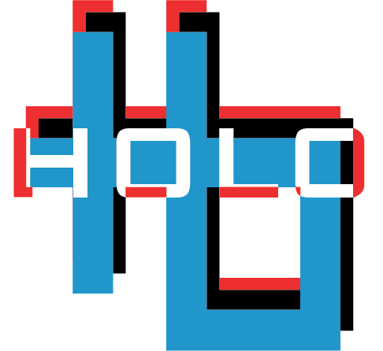

[![Contributors][contributors-shield]][contributors-url]
[![Forks][forks-shield]][forks-url]
[![Stargazers][stars-shield]][stars-url]
[![Issues][issues-shield]][issues-url]
[![MIT License][license-shield]][license-url]
[![LinkedIn][linkedin-shield]][linkedin-url]

<!-- PROJECT LOGO -->
<br />

<p align="center">
  <a href="#">
    
  </a>

  <h1 align="center">HOLO</h1>

  <p align="center">
    Better visualize 3D objects and ideas
    <br />
    <a href="https://github.com/chinarjoshi/holo"><strong>Explore the docs »</strong></a>
    <br />
    <br />
    <a href="#">View Demo</a>
    ·
    <a href="https://github.com/chinarjoshi/holo/issues">Report Bug</a>
    ·
    <a href="https://github.com/chinarjoshi/holo/issues">Request Feature</a>
  </p>
</p>

<!-- TABLE OF CONTENTS -->
<details open="open">
  <summary>Table of Contents</summary>
  <ol>
    <li>
      <a href="#about-the-project">About The Project</a>
      <ul>
        <li><a href="#built-with">Built With</a></li>
      </ul>
    </li>
    <li>
      <a href="#getting-started">Getting Started</a>
      <ul>
        <li><a href="#prerequisites">Prerequisites</a></li>
        <li><a href="#installation">Installation</a></li>
      </ul>
    </li>
    <li><a href="#usage">Usage</a></li>
    <li><a href="#roadmap">Roadmap</a></li>
    <li><a href="#contributing">Contributing</a></li>
    <li><a href="#license">License</a></li>
    <li><a href="#contact">Contact</a></li>
    <li><a href="#acknowledgements">Acknowledgements</a></li>
  </ol>
</details>

## Purpose

Many designs, products, and ideas get shutdown due to understanding on how it works or how its used, but with this product it allows a much easier representation and understanding.

## Four pillars of engineering

### Serve an unmet need
The need is that when I'm showing a cad model, they might not fully understand it from the cad mode. If they actually had the physical object it will be easier to understand from all angles rather than a flat representation.

### Be easy to use/understand
There will be two parts of the project: The actual table and a web app to load a cad file. (.obj, .stl). Gesture control, rotate, and scale to blow up and shrink images. Might be easier to use as a button in terms of ability to make it.

### Be attractive and compelling
It's simple and elegant. The side design will mask the ugly edges, and the edges would sort of warp the hologram. The design is sleek and minimalistic, drawing the attention to the hologram.

### Be efficient to produce
It uses cheaper and more avalbile materials with a minimalistic yet effective design to create a display that is as close as it can be to creating a tangible representation from a CAD model.


## Materials

- 1/16 inch acrylic
- 1/8 inch pine
- codium
- base: 1/4 inch pine
- Screw size: t25 1/2 inch
- LCD: smallest laptop size (14 inch)
- Bluetooth/HDMI connection to device
- Arduino Uno/ESP32
- Webcam for computer vision gesture control

## Minimal Viable Product
 - Level 1: We will be able to load a cad file from filesystem/usb, and have that file displayed on the hologrpahic desk.
 - Level 2: Includes hand gestures for rotation/scale, and joystick/buttons for analog input.
 - Level 3: Adapted machine learning model for detecting finished/unfinished parts of the CAD model.

## Timeline

### Stages
We will follow an iterative development strategy to create multiple functional prototypes before the final product.

Break up timeline into research, development, and testing.

### Timeline
[WEEK 1]
FRI 2:
SAT 3:

[WEEK 2]
SUN 4: Finish program and begin testing
MON 5: Finished with mechanical design
TUE 6:
WED 7:
THU 8: _Finished with first iteration_
FRI 9:
SAT 10:

[WEEK 3]
SUN 11:
MON 12:
TUE 13:
WED 14:
THU 15: _FINAL PRESENTATION_

## Getting Started

### Prerequisites
Only for localhost usage

* pip
  ```sh
  pip install -r holo/requirements.txt
  ```

### How to use

<small><i>Locally</i></small>
1. Clone the repo
   ```sh
   git clone https://github.com/chinarjoshi/holo
   ```
2. Install prerequisite packages
   ```sh
   pip install -r holo/requirements.txt
   ```
4. Run the flask entrypoint
   ```sh
   python3 holo/src/wsgi.py
   ```

<!-- USAGE EXAMPLES -->
## Gallery

WIP

_For more examples, please refer to the [Documentation](https://chinarjoshi.com/holo)_

<!-- ROADMAP -->
## Roadmap

__See the [open issues](https://github.com/chinarjoshi/holo/issues) for a list of proposed features (and known issues).__
<br>

<!-- CONTRIBUTING -->
## Contributing

Any contributions to extend features are **greatly appreciated**.

1. Fork the Project
2. Create your Feature Branch (`git checkout -b feature/newFeature`)
3. Commit your Changes (`git commit -m 'Add NewFeature'`)
4. Push to the Branch (`git push origin feature/newFeature`)
5. Open a Pull Request

<!-- LICENSE -->
## License

Distributed under the MIT License. See `LICENSE` for more information.


<!-- CONTACT -->
## Contact

Chinar Joshi - chinarjoshi7@gmail.com - [Linkedin](https://linkedin.com/in/chinar-joshi-905493207/)

Project Link: [Github](https://github.com/chinarjoshi/holo)


## Acknowledgements
* [Readme Template](https://github.com/othneildrew/Best-README-Template)
* [Img Shields](https://shields.io)
* [GitHub Pages](https://pages.github.com)
* [Animate.css](https://daneden.github.io/animate.css)
* [Loaders.css](https://connoratherton.com/loaders)

<!-- MARKDOWN LINKS & IMAGES -->
<!-- https://www.markdownguide.org/basic-syntax/#reference-style-links -->
[contributors-shield]: https://img.shields.io/github/contributors/chinarjoshi/holo?style=for-the-badge
[contributors-url]: https://github.com/chinarjoshi/holo/graphs/contributors
[forks-shield]: https://img.shields.io/github/forks/chinarjoshi/holo?style=for-the-badge
[forks-url]: https://github.com/chinarjoshi/holo/network/members
[stars-shield]: https://img.shields.io/github/stars/chinarjoshi/holo?style=for-the-badge
[stars-url]: https://github.com/chinarjoshi/holo/stargazers
[issues-shield]: https://img.shields.io/github/issues/chinarjoshi/holo?style=for-the-badge
[issues-url]: https://github.com/chinarjoshi/holo/issues
[license-shield]: https://img.shields.io/github/license/chinarjoshi/holo?style=for-the-badge
[license-url]: https://github.com/chinarjoshi/holo/blob/master/LICENSE
[linkedin-shield]: https://img.shields.io/badge/-LinkedIn-black.svg?style=for-the-badge&logo=linkedin&colorB=555
[linkedin-url]: https://www.linkedin.com/in/chinar-joshi-905493207/
[product-screenshot]: images/screenshot.png
